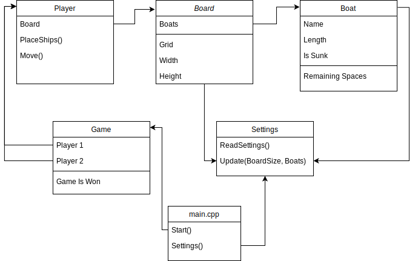

# AdaShip
AdaShip AP-2 assignment

# Challenge Outline
The proposed problem was to create a simple battleships style game which became increasingly convoluted with extra requirements. 
These requirements include but aren't limited to extra game modes, fixed output and gameplay formats and restricted configuration 
logic. At the core of the problem, the game itself should have been the most difficult part of the problem. The solution should 
provide a platform for a person to place ships and attack their opponent's ships in a turn based paradigm. The game can inherently 
be broken down into its fundamental parts which can, in turn, be examined independently. These parts, from here on called 
components, form the basic file/class structure of the final solution and describe how the different classes may work together to 
achieve a working solution. 

The first part of any game like this is the game's board. Battleships usually comprises of two 10x10 grids with lettered columns 
and numbered rows. Each player has their own board and then they have an obscured view of their opponent's board whereby they are 
unable to see each other's ships until they have been hit. The board also needs to have a working and tightly integrated coordinate 
system so that squares can be easily queried and manipulated. This should be a separate but loosely coupled component as coordinates 
should have the ability to be used outside of the board itself.

The next object to consider is the player. Battleships is a 2 player game and so whether the players are computers or human, there must 
be 2 players for each game. Each player needs their own board and should be given a view of their turn (a turn view). A player's turn 
view should consist of their opponent's board above their own. The coordinate system should be printed on the top and left of the board 
so that the player can easily identify where they would like to attack. When the turn switches to the other player, these two boards are 
effectively swapped as the current player's attacking board is always the previous player's board. 

Briefly mentioned earlier was the concept of a game. We can extract the idea of a game into its own component. A game component should 
keep track of which player's turn it currently is as well as checking whether either player has won the game. It will also be the main 
method of communication between the two opposing players. This adds a level of protection between the two player components. The 
specification states that an excellent solution should support multiple game types including the salvo game and the mine game. A game 
component could house and differentiate the logic between these game variations.

### Context (aside):
- The salvo game is a modification of the original game where each player can take N shots where N is the number of unsunk ships the 
  player has left.
- The mine game is more similar to the original game but adds 5 mines to the board which when struck, attack all adjacent squares 
  including recursively attacking neighbouring mines.

With one of the project requirements being a need to read configuration settings from an external file called 'adaship_config.ini', it 
would be sensible to enclose this logic in its own component thus relieving any other component from bearing the burden of reading and 
writing to the settings in addition to its primary function. In my final solution, I called this file SettingsIO as it provides input 
and output to and from the configuration file.

The last main component that is needed represents the boats. Boats can have differing lengths and names and this all needs to be tracked. 
Boats also need to know whether they have been sunk or whether they are still floating. This property is especially important in the 
salvo game where this information is used to calculate how many shots a player should receive. The largest challenge with the boats is 
ensuring that the program always modifies the same instance of that boat. There should at most be 2 instances of each boat (one for each 
player) during a game. Every other reference to a boat should be a pointer to one of these instances.

## UML Diagram

While this is a very basic diagram, it illustrates the rough picture of how the fundamental components would work together. In the final 
solution, things like board squares and the results of players' turns were extracted into their own small components for convenience.

### Epics
1. Create board and coordinate system which work together.
    - The board should have a grid which can be stored as a matrix or two dimensional vector for ease of use.
    - The board should support being able get and set the status of a board square using a coordinate for reference.
    - Coordinates should be instantiable with either a column and row value or a string value (eg. A71).
    - The board should provide views of the grid for both the owner and the opponent.
    - The board should keep track of the boats it contains: how many there are remaining and where they are.
2. Create player component which has a board and a move method for taking a turn automatically.
    - The board can be instantiated when the player is instantiated.
    - The move method can return a valid coordinate denoting where the player would like to attack on their opponent's board.
    - The move method can choose a coordinate randomly for now. 
3. Create game component which has two players and can organise the turn taking logic between the two players.
    - The players should be initialised when the game component is instantiated.
    - A while loop can be used with the exit condition of one of the players having no remaining ships.
    - Within the while loop, a boolean value can be negated to switch between each player's turn.
    - The current player's move method should be called and the result should be passed to their opponent's board.
        - May need to implement attack logic in the board component.
4. Add boat placement logic to the player component.
    - Boat placement can be done randomly with valid configurations.
    - Need to write algorithm for getting valid placements which don't go outside the bounds of the board and don't overlap with an 
      existing ship.
    - Once this is done, a rudimentary game should be able to be played between two AI players.
5. Add logic to interface with the configuration file.
    - Before this, can be mocked with a const value.
    - Add a function to read the board dimensions and list of boats from the file.
    - Add a function to add new boats to the file.
    - Add a function to remove boats from the file.
    - Add a function to update the board dimensions.
    - These functions can be made static so that the SettingsIO component does not need to be instantiated.
6. Add logic to differentiate between human and AI players.
    - Add an interface which allows a user to input a simple coordinate eg. A4 within the move method.
    - Add an interface which allows a user to place their boats.
        - This will require a method which shows the user placement options they can choose from. (Requires 4.2)
7. Add a menu.
    - This can be done in the main.cpp file. Should be simple to use. Using numerical options is easiest.
    - Should be able to instantiate a game from the menu and start it.
8. Add UI to allow interfacing between the written methods and the user
    - Show valuable information to the user like which boat is currently being placed.
    - Provide the user with options like choose another boat placement, reset all boats etc. (requirements in spec).
    - Give the user the choice to use the auto place and auto fire options.
9. Add validation to prevent erroneous data being added
    - Ensure that only valid inputs are being processed. Don't allow coordinate inputs which exceed the boundaries of the board.
    - Add fixed option validation to all numerical menus.
10. Add extensions (eg. salvo game mode and mine game mode)
    - Modify and extend the game component to add an extra for loop in salvo mode which runs for every ship the current player has 
      remaining.
    - Modify the board and game components to allow mines to be added at the beginning of the game and processed throughout the game.

# Development
## Best Practices
When endeavouring to create such a large solution like this, it is vital to at least partially plan the project's structure. It is good 
practice and standard in C++ development to split classes into header and source files. The class itself should be located in the header 
file with forward declarations for all of the methods. Then, in the source file, definitions should be given for each of these methods. 
This format keeps your code clean and allows somebody to see the structured outline of your classes by just looking at the header files.

Another good practice is to use header guards on your header files. A header guard checks if a unique value isn't defined and if it isn't, 
it defines it. Your class' code should follow this definition and the header file should end with an endif. The result of this is as 
follows: whenever the compiler attempts to load the header file, if it has already been loaded, the check on the unique value fails as it 
has already been defined and none of the code inside the header file is loaded. This prevents redefinitions which can lead to compiler 
errors.

It's also good to ensure that your code is consistent. This is usually impossible to do perfectly but deciding and clarifying things like 
what indentation size to use before starting the project can help make the final code much more readable. Initially, development was done 
locally. This was faster and more reliable than developing online and allowed me to make use of powerful tools like a debugger in the 
early stages when it was most vital. I used CLion to create the project. CLion was useful as it formatted my code consistently for me and 
notified me when I had errors in my code before I compiled it saving me lots of time.

## Phase 1- 02/03/2021
On the 2nd of March, I created the Board and Coordinate class. As planned, I got these to work together and managed to have a simple board 
programmatically set up and queried using coordinates created from human readable names. I also created a Boat class and integrated it with 
the board class so that a fixed number of boats could be statically placed on the grid and shown.

## Phase 1.1- 03/03/2021
The following day, I created a class for Board squares. This class was designed to be a fixed instance class like a singleton but instead 
of only one instance being available, there would be one instance per board space type. I designed the class to have 4 private instances 
to which pointers could be gotten using public methods. The instances represented the 4 states a square on a board could be in: empty, boat, 
hit and miss. 
When I first made the class, I wrote the entire class in the header file. As it was only small, I thought that this would suffice until later 
in the development. There were issues with the instances and the program wasn't compiling. After researching I found out that the static 
private instances I was using needed to be initialised. I created an accompanying source file and initialised them to null pointers and the 
program compiled.

Next, I refactored my Board class so that it's 2D vector stored BoardSquare pointers instead of strings and I contained the string 
representations within the BoardSquare instances themselves. I learned later that this was a good decision as it meant that invalid board 
square values were impossible because only the 4 instances of BoardSquare could exist on the board.

## Phase 1.2- 05/03/2021
This phase involved creating the game component, the player component and a rudimentary SettingsIO class. Now that the board was working 
properly, I decided to create a game component which instantiated two players and played a simple game between them. The player classes had 
their boards statically set with boats already placed and chose squares to attack entirely randomly. As a result, games took many turns to 
complete. To make adding a human move method easier later on, I added a boolean value to the player class called isHuman. For human players, 
this was obviously set to true and it was false otherwise. When implementing the player's behaviour, I could now guard it behind this boolean 
and whenever the time came to add a human compatible alternative, I could just add an else statement.

When the game component was initialised, it needed to get the current boats and board size from the configuration file but I hadn't written 
the logic for reading from/writing to a file yet. I decided to implement a dummy function which returned the default board size and ships so 
that development could continue.

## Phase 1.3- 08/03/2021
After a few days of adding logic to the board, game and player components so that they could play a real game, it came time to add the human 
logic to the player class. I had been trying to do this with the aforementioned boolean flag in the days prior but by the 8th, I realised that 
the best solution would be to make the Player class abstract and have two subclasses: one for HumanPlayer and one for AIPlayer. These two 
subclasses could then override and implement methods like place boats and move as they need. Logic which would be shared between them could 
stay in the player class which would save repeating the same code in two separate files.

One thing I learned when creating these subclasses is that C++ has the idea of private inheritance as well as public inheritance. Additionally, 
in order for a variable of type Class to be instantiated with a type SubClass where SubClass is a subclass of Class, you must use a pointer. 
While this change had little effect on the overall solution, it did mean that I had to change Game's player1 and player2 attributes to be of 
type Player*.

By the end of this phase, I was able to play a simple game of Battleships with the computer. I could place my ships using coordinates to choose 
an anchor point and then I could use numbers to choose from one of the available placement options. Then the game would start and I could input 
coordinates to attack and they would show up on the board as either hits or misses. Unfortunately, the game wasn't finishing when one of us had 
completely run out of ships. It took me a few days until I was able to find and fix the problem.

## Phase 2
The issue was that some of the boats which had been hit and sunk weren't having their remainingSpaces variable reduced as they should. The 
remainingSpaces variable is a list of spaces that the boat occupies which haven't been hit. When the list is empty, the boat is sunk. After a 
lot of debugging, I found that when I looked them up in the board's list of boats, their names did not match what they should have been. Some 
of the boats' names had been cleared. I stepped through the initialisation of the board's boat list and they all had names when the game began 
but somewhere during the game the names were being erased. Without any other interaction happening with the list in-game, I eventually came to 
the conclusion that somewhere in the program, a pointer to a boat was being used. The original boat object that was being pointed to must have 
moved out of scope and the pointer became invalid. I wrote an assertion which periodically checked whether any of the board's boats' names had 
been cleared. I also added a destructor to the boat class so that I could see when the boat classes were being destroyed. As expected, it was 
called multiple times at the start of the game (during the initialisation process) but I also saw the destructor being called just before the 
assertion failed. This confirmed that it was an issue with the pointers and so I refactored the code so that the boats are set for each board 
once and then kept for the duration of the board's lifespan. All other boats are pointers to those instances and the issue had been resolved.

The solution now worked as a game. I could play a game against the computer, I could play a 2 player game or I could watch 2 AIs play against 
each other.

## Phase 2.1- 19/03/2021
The next component I added was called Common. I created this class to hold constants that I may need thoughout the program (like a string to 
clear the screen) as well as some helper methods which would make creating UIs easier. To handle UI input, I created a function called 
validatedInput. This function took a string prompt, a lambda validator and a string error message. It would print the prompt and get user input 
using getline(). While the input failed the validator function, it would print the error message and ask for the input again. This was possibly 
the most useful function of the whole project as it meant that any time I needed to get user input, I could just call this function and write a 
short validator which could be customised to each use case.

Later on, I also added the isOneOf helper method. This returns a validator to be used with the validatedInput method. isOneOf takes a vector of 
options and checks whether the input is contained within the vector. This was indispensable when designing and creating the menus as each time 
I needed to check whether the user's input was one of the numerical options, I could simply create a vector with the options, pass it to isOneOf, 
and pass the return value to validatedInput.

## Phase 3- 22/03/2021 onwards
Moved to online development using the Repl.it platform with GitHub. During the course of the development, I had added many static enums and 
classes to other classes. This is generally bad practice and so during phase 3, I worked to refactor much of the code. Classes like BoatPosition 
which was originally part of Boat, got moved into its own header/source file.

I also spent time ensuring that the solution met the requirements for pass, merit and distinction levels. I added the features necessary to comply 
with the pass grade, moved onto merit and then realised that I hadn't implemented the extra features required for distinction: the salvo and mine 
games. I copied the Game class' start method and modified the turn logic by adding a for loop which iterated through the current player's remaining 
ships. This yielded the desired behaviour with minimal changes to the wider solution so I added the corresponding options to the menu and moved on 
to the mine game. At first, I thought about storing the mines for each player within the game class itself as I didn't want to modify the Board 
class as by extension, I'd also have to modify the BoardSquare class and then update the switches throughout the project that use BoardSquare. I 
copied the start method in game much like I did with the salvo game but evetually realised that the easiest way would be to add the extra board 
square. I realised that I could add the mines at the beginning of the mineStart method (as all boat placement happens when the game class is 
initialised) and then call the original start method. This shortened the code within the game component significantly and made the final solution 
much cleaner.

I then proceeded to continue with code cleanup and refactoring and did some final testing to ensure there weren't any bugs. After trying the 
different game modes I found 3 bugs remaining in the system. 
The first was that if the user didn't use capital letters when specifying a coordinate or option (like Q to quit), the system would break. This 
led me to implement an optional bool parameter in my validatedInput method called autoCapitalise. When set to true, the input is automatically 
capitalised to avoid any issues. 
The second bug was that the user wasn't being given an opportunity to review their ship placements before starting the game. This was a requirement 
in the specification and so I added a small speedbump which checks that the user is happy with their ship positions. 
The final bug was that in the mine game, sometimes less than 5 mines were being added to the board. I found that this was happening because an if 
statement had been changed from one line to two lines but the curly braces had not been added. As a result, even when mines weren't being added, 
they were still being counted as added which had led to occasional missing mines.

# Evaluation
During the refactoring process I managed to clean up the code a drastically reduce the number of lines. One example of how I reduced repetitive code 
is the code for getBoardForOwnerAsString() and getBoardForOpponentAsString() in the Board class. Originally, there were two methods like this:

    std::string Board::getBoardForOwnerAsString() {
        std::string returnString = "  ";
        std::string currentColumn;
        for (int c = 1; c <= this->_width; c++) {
            currentColumn = Coordinate::getColumnFromNumber(c);
            returnString += " " + currentColumn + (currentColumn.size() == 2 ? "" : " ");
        }
        returnString += "\n";
        for (int row = 0; row < this->_height; row++) {
            returnString +=  std::to_string(row + 1) + (row <= 8 ? " " :  "");
            for (BoardSquare*& item : this->_boardMatrix[row]) {
                returnString += BoardSquare::EMPTY()->toString();
            }
            returnString += "\n";
        }
        return returnString;
    }

    std::string Board::getBoardForOpponentAsString() {
        std::string returnString = "  ";
        std::string currentColumn;
        for (int c = 1; c <= this->_width; c++) {
            currentColumn = Coordinate::getColumnFromNumber(c);
            returnString += " " + currentColumn + (currentColumn.size() == 2 ? "" : " ");
        }
        returnString += "\n";
        for (int row = 0; row < this->_height; row++) {
            returnString +=  std::to_string(row + 1) + (row <= 8 ? " " :  "");
            for (BoardSquare*& item : this->_boardMatrix[row]) {
                if (item != BoardSquare::BOAT())
                    returnString += item->toString();
                else
                    returnString += BoardSquare::EMPTY()->toString();
            }
            returnString += "\n";
        }
        return returnString;
    }

I noticed that these methods were essentially doing the same thing apart from the if condition in the middle and so I refactored them and extracted 
a helper method. Now the code looks like this: 

    std::string Board::getBoardForOwnerAsString() {
        return _getBoardForPlayer(/* isOwner= */ true);
    }

    std::string Board::getBoardForOpponentAsString() {
        return _getBoardForPlayer(/* isOwner= */ false);
    }

    std::string Board::_getBoardForPlayer(bool isOwner) {
        std::string returnString = "  ";
        std::string currentColumn;
        for (int c = 1; c <= this->_width; c++) {
            currentColumn = Coordinate::getColumnFromNumber(c);
            returnString += " " + currentColumn + (currentColumn.size() == 2 ? "" : " ");
        }
        returnString += "\n";
        for (int row = 0; row < this->_height; row++) {
            returnString +=  std::to_string(row + 1) + (row <= 8 ? " " :  "");
            for (BoardSquare*& item : this->_boardMatrix[row]) {
                if (item != BoardSquare::BOAT() || isOwner)
                    returnString += item->toString();
                else
                    returnString += BoardSquare::EMPTY()->toString();
            }
            returnString += "\n";
        }
        return returnString;
    }

Not only does this make the code easier to read but it also means that in the future if this logic needs to be changed, it can be changed in one 
place and there is no risk of the two methods diverging.

Something that is generally considered bad practice is using gotos. This is because they can be easily and are often misused and can lead to what's 
called spaghetti code. In my HumanPlayer ship placement code I had to use a goto so that I could exit both an embedded loop as well as the enclosing 
loop. This was the most straightforward way to achieve the desired behaviour and while there may be a way to do the same thing without the goto, it 
is a valid use case for a goto.

My solution showcases inheritance of abstract classes with method overriding, the BoardSquare class with a fixed number of instances as well as a 
friendly and intuitive UI. Two methods I added to the Common class are centerHorizontally and centerVertically. These methods take a piece of text 
and center it width a column width or row height respectively. This was used in particular with the menus and turn results to center align text. 
Though it's a small change, having center aligned text helps make the game feel less like a console application.

Although I would've liked to add automated unit tests, I didn't have time to write these. They would've ensured that any added logic did not break 
the game and they would've helped me debug issues quicker. Instead, I carried out manual testing by hand and also had other people use the program 
to make sure that the interface was easily navigable.

For the improved targeting system, I wanted to design something effective yet still simple. I thought about how a human plays the game Battleships. 
Humans guess randomly until they get a hit and then change their behaviour. They search adjacent squares to gauge which direction the ship is facing. 
They then systematically attack the squares in the correct direction until the ship is sunk and then they repeat. I added a cache of squares to search 
called squareCache to AiPlayer. When AiPlayer gets a hit, it adds the adjacent squares to the cache. When it is asked to move, if the cache has squares 
in it, it pops a square from the cache and attacks there. If it is a hit again, that square's adjacent squares get added and the process continues. Once 
the AiPlayer is told that the ship is sunk, the squareCache is cleared so that the targeting system doesn't just target the neighbouring squares around 
the sunk ship. When there are no squares in the squareCache, the targeting system gueses randomly. When I switched from random to this targeting system 
on blind games, the computer was much closer to beating me in games. When starting a game with 2 AiPlayers using the new targeting system, the game would 
finish in significantly fewer moves when compared to the random algorithm.

I think my final solution is a robust, complete product which could be used by any new user without any confusion. It functions like a real game of 
battleships and provides all the features and game modes requested in the specification. Thanks to its built-in input validation, it stands up to erroneous 
data and can handle and recover from mistakes. 

With more time, I might include a setup screen which ensures that the console is big enough to support the board size. Larger board sizes struggle to fit 
on smaller screens and if the console isn't at least W * 3 + 2 characters wide where W is the width of the board then the game is practically unplayable. 
It would also be nice to implement some sort of checking on the number of ships you can add to make sure that the number of spaces the ships require does 
not exceed the number of spaces available on the board. For example, having 6 ships of length 5 on a board of 5x5 would not work and having a ship of length 
11 on a 10x10 board could not be placed. I didn't have time to add this validation in but it would be quite simple to add to the method which updates the boat 
list and board dimensions to do a check on the other and compare sizes.
